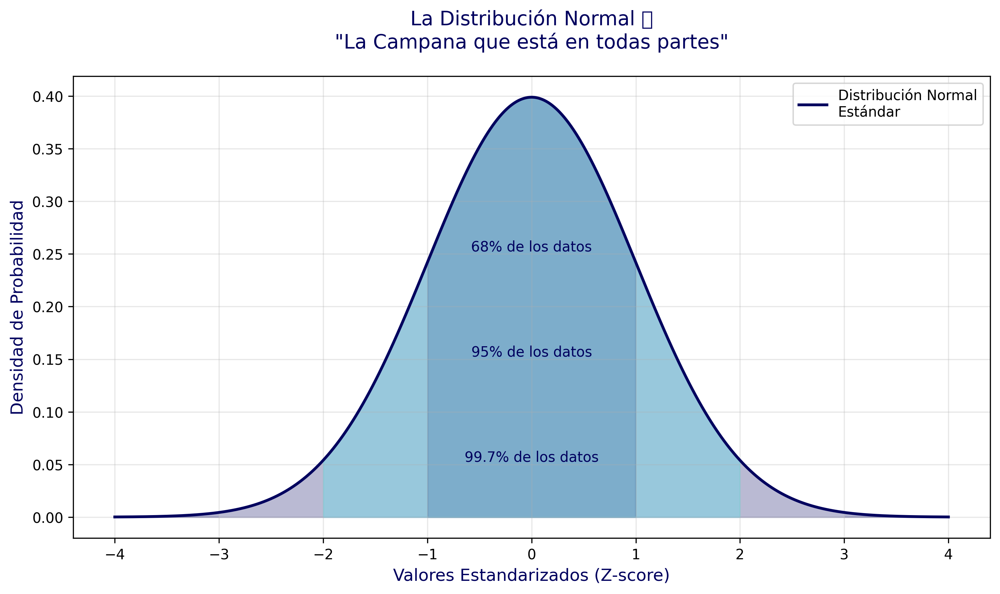
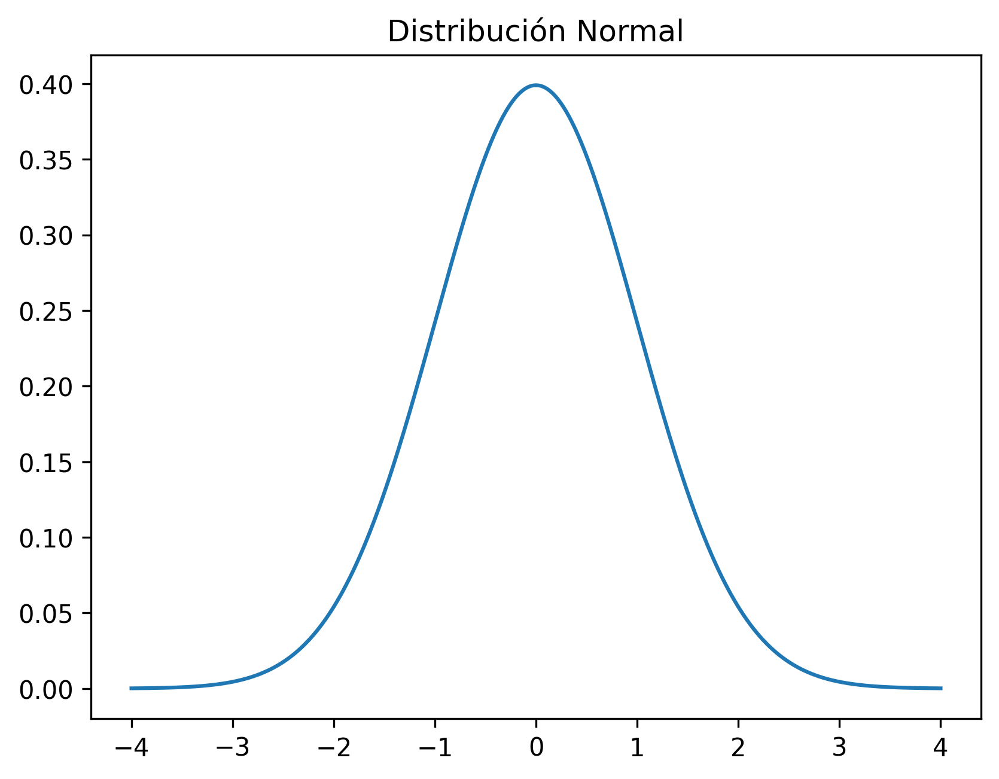

# Día 1 - La Distribución Normal
"La Campana que está en todas partes"

## Metadata
- Series: #30DíasDeDataScience
- Tema: Distribución Normal
- Nivel: Principiante
- Código: Python

## Contenido Carrusel

### Slide 1: Portada
```text
La Distribución Normal
"La Campana que está en todas partes"
#30DíasDeDataScience - Día 1
```

### Slide 2: Introducción
```text
¿Qué es la Distribución Normal?
• La forma más común en que se distribuyen los datos en la naturaleza
• También llamada "Campana de Gauss"
• Simétrica alrededor de su media
• Base fundamental de la estadística moderna
```

### Slide 3: Visualización


### Slide 4: Ejemplos Prácticos
```text
¿Dónde la encontramos?

📏 Altura de las personas
📊 Calificaciones escolares
⌚ Tiempo de entrega de pedidos
🌡️ Temperatura corporal
🧬 Medidas biológicas
```

### Slide 5: La Regla 68-95-99.7
```text
La Regla de Oro 📊

68% de los datos están a 1σ de la media
95% de los datos están a 2σ de la media
99.7% de los datos están a 3σ de la media

σ = desviación estándar
```

### Slide 6: Código Python
```python
import numpy as np
import matplotlib.pyplot as plt

x = np.linspace(-4, 4, 1000)
y = 1/(np.sqrt(2*np.pi)) * np.exp(-x**2/2)

plt.plot(x, y)
plt.title('Distribución Normal')
plt.show()
```


## Recursos
- Código: https://github.com/ronaldmego/data-science-path
- Más contenido: https://linktr.ee/ronaldmego

## Hashtags
#DataScience #Estadística #Python #DataVisualization #DistribuciónNormal